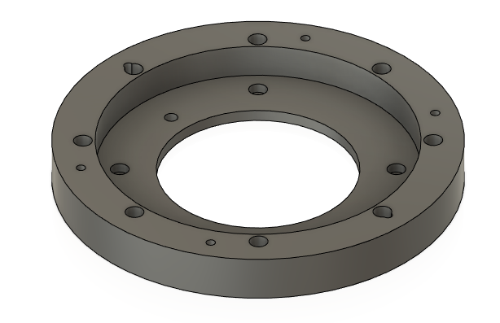
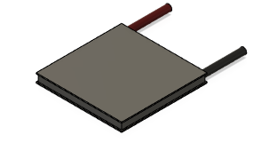
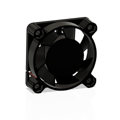
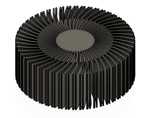
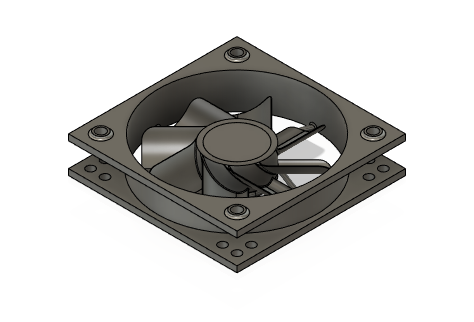
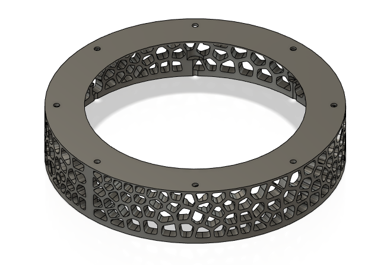
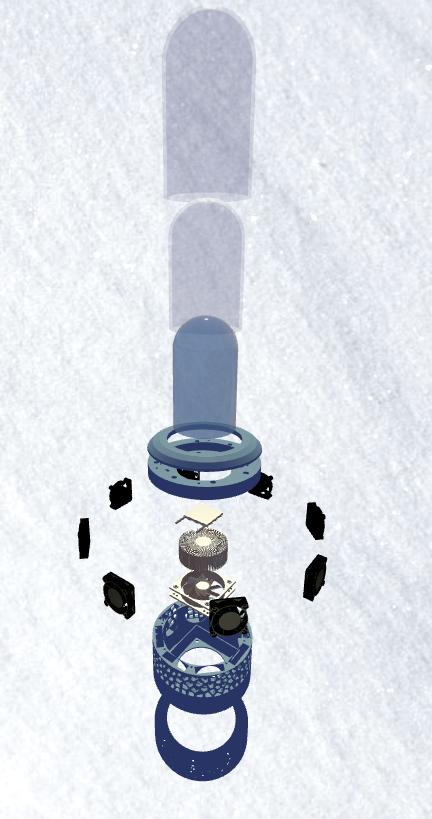

# Assembly of MCC V1

The Version 1 of the Mobile Cryo Capsule has a vertical assembly, with most components being attached towards the central body. An interractive view of the project can be seen at https://jeeezzus.github.io/MDT_Three.JS/.

Here is a representation of each part of the project

|Part|Description|
|-|-|
||Outer Bell: A transparent glass bell serving as an external insulating wall.|
||Inner Bell: A transparent glass bell serving as an internal insulating wall and container for ice.|
||Cover:A decorative piece that conceals the silicone joint.|
||silcRing: This plastic piece allows for holding and compressing the silicone seal between the bells and the metal core to ensure the system's watertightness.|
||Peltier Module: Produces cold on one side and heat on the other when supplied with electricity. This component is used to extract energy from the ice.|
||Upper fans (X8): These fans are used to draw air into the system around the radiator, ensuring uniform cooling.|
||Radiator: Dissipates Peltier's heat using air.|
||Main Fan: Pulls air out of the system, ensuring optimal airflow.|
||Corps: The main part of the assembly. It serves to maintain the entire structure.|
||Bottom: The piece supporting the assembly. It serves to ensure sufficient space for the escape of air from the radiator.|

