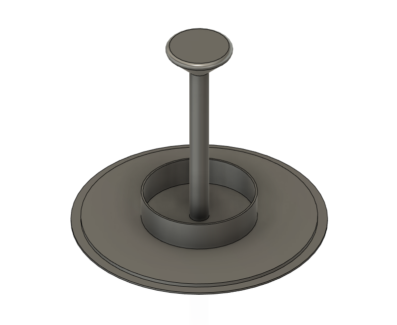
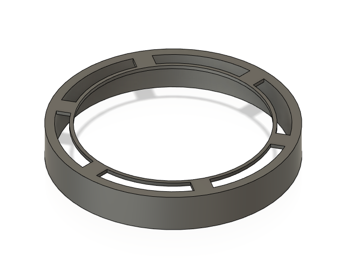
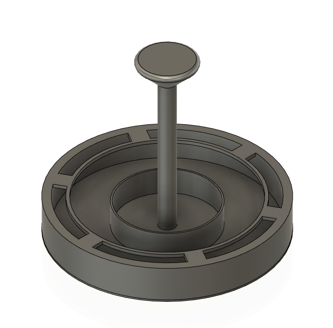
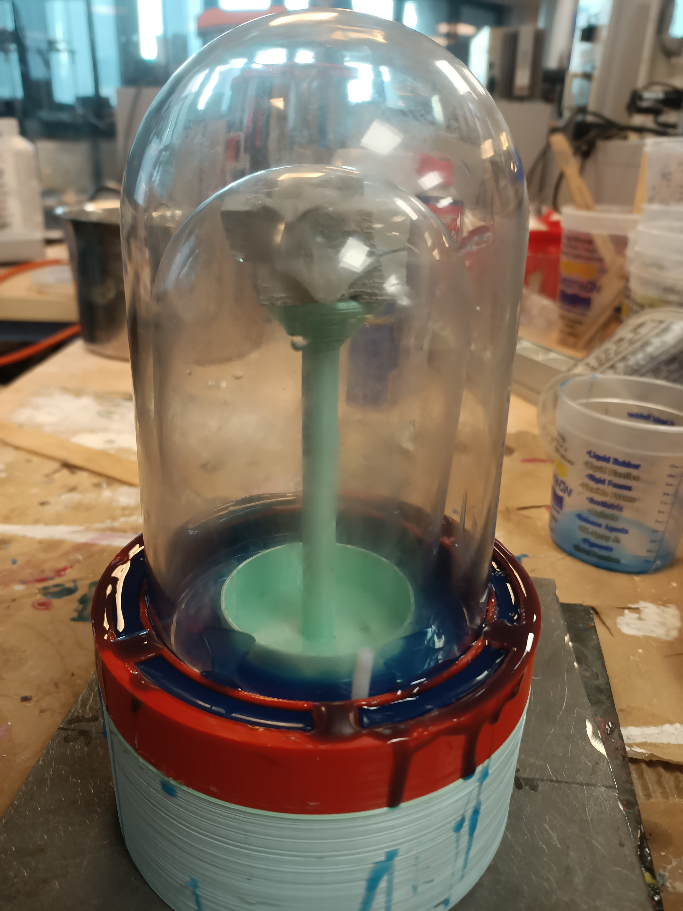

# Silicone Molding for the Seal of Both Versions of the Mobile Cryo Capsule

> For both MCC_V1 and MCC_V2 versions, the molding process is identical.

## Purpose of the Silicone Seal
The silicone seal ensures water tightness (present with ice inside the inner bell which can melt), as well as air tightness to maintain the vacuum between the bells.

To achieve a perfect assembly, the bells are directly used for molding since silicone adheres weakly to glass.

## Process
Firstly, print and assemble the mold.

|  Interior | + | exterior | = | mold|
| -------- | ------- | ------- | ------- | ------- |
|  | + |   | = |  |

The height of the rod and the diameters need to be adjusted according to the purchased bells.

Next, drill in the center to allow air to escape during pouring and drill then thread the necessary tubing for vacuum creation.

The bells are held in place with the rod for the interior and the ring for the exterior. It is advised to use small dots of hot glue to ensure the assembly stays together.

Finally, pour 125-150 mL of silicone in two parts. Using Moldstar or a slightly flexible Dragonskin allows for increased tightness.

