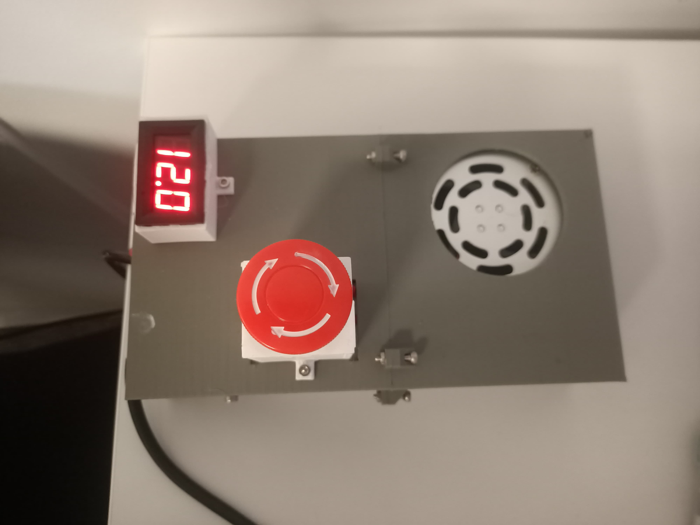

# PSU assembly

It's recomended to split the Corps.stl in two of your printer is not big enough.

For a TEC12710 peletier module, it's recomended to have a PSU that can deliver more than 120W of power. 

Simply slide the PSU inside the casing, then place a voltmeter and a emergency buton on top then, make the connection: the emergency stop is between the peletier and the PSU.

