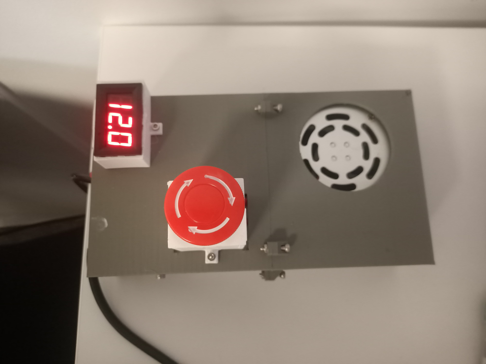

# Security informations for the Mobile Cryo Capsule

Here are some safety instructions for the project. If anything goes wrong, the first thing to do is shut down everything (see below).

The major risk of the system is its high power consumption (150W at peak during start-up). The two side-effects are that the Peltier module produces a lot of heat and that water is very close to the electricity.

## Shutting Down Everything
Shutting down the system works in two steps.
> First, press the emergency stop button (basically, just hit the big red thing).  This will cut the power of the freezer instantly, BUT NOT THE POWER OF THE PSU.

Please remember to keep the emergency stop always accessible.

> Then, once the emergency stop is pressed and only the PSU is powered, unplug it for a smooth shutdown.
Please only unplug directly (without pressing the emergency stop) in case of an emergency, as it might damage the system.

## Don't Touch Where You Shouldn't
Some parts of the MCC can be hot, spin quickly, or carry a lot of power. Basically: do not touch the system while it's running. And if you need to, here are the things NOT to do:

> Don't touch the Peltier module while powered (the hot side can be very hot, the cold side quite cold) or if it's covered in thermal paste.

> Don't touch the fans, especially if they are spinning (it can hurt you and damage the blades).

> Don't touch the power connections while plugged in (even if the emergency stop is pressed) to avoid electrocution.

## Other Warnings
> Please ensure the airflow for both the MCC AND the PSU is unobstructed: they need to have sufficient free space.